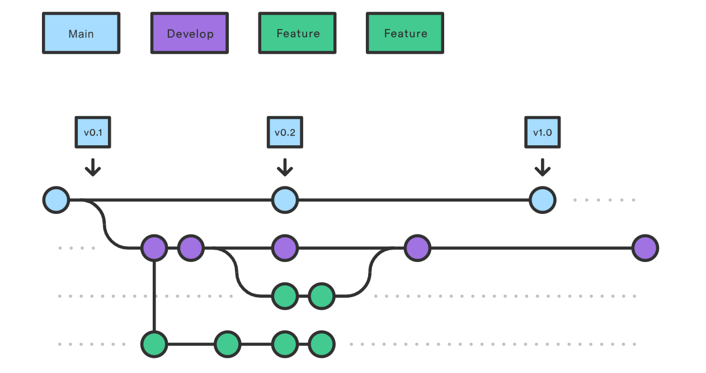

# Contributing Guidelines <!-- omit from toc -->

To ensure smooth collaboration, please follow these guidelines.

## Table of Contents <!-- omit from toc -->

- [Branching Strategy](#branching-strategy)
  - [Creating a Feature Branch](#creating-a-feature-branch)
  - [Pull Requests](#pull-requests)
- [Commit Message Conventions](#commit-message-conventions)
  - [Types](#types)
  - [Examples](#examples)
- [Tooling](#tooling)

## Branching Strategy

We follow a [Feature Branch Workflow](https://www.atlassian.com/git/tutorials/comparing-workflows/gitflow-workflow) strategy. This means:

- **Main Branch:** The `main` branch always reflects the production-ready state.
- **Development Branch:** The `develop` branch serves as the main integration branch. All feature branches are merged into this branch for testing before being merged into `main`.
- **Feature Branches:** For each new feature or bug fix, create a new branch off `develop`. Use descriptive branch names that reflect the nature of the work being done.



### Creating a Feature Branch

When working on a new feature or bug fix:

1. Ensure you are on the `dev` branch: `git checkout dev`
2. Create a new branch: `git checkout -b feature/your-feature-name`
3. Implement your changes in this branch

### Pull Requests

When submitting a Pull Request:

1. Ensure your branch is up to date with `dev`: `git pull origin dev`
2. Rebase your branch if necessary to incorporate the latest changes: `git rebase dev`
3. Submit your Pull Request targeting the `dev` branch
4. Provide a clear description of the changes made and any relevant information for reviewers

To learn more about Git, check out [Learn Git Branching](https://learngitbranching.js.org/).

## Commit Message Conventions

We use [Conventional Commits](https://www.conventionalcommits.org/en/v1.0.0/) for our commit messages. Each commit message consists of a type, a brief description, and an optional body.

A commit message follows this format:

```bash
<type>: <description>

[optional body]
```

### Types

- **feat:** A new feature
- **fix:** A bug fix
- **docs:** Documentation changes
- **refactor:** Code refactoring
- **style:** Code style changes (formatting, indentation)
- **test:** Adding or modifying tests
- **chore:** Changes to the build process, dependencies, or other non-code modifications

### Examples

- `feat: adds user authentication feature`
- `fix: resolves issue with form validation`

- **With a body:**

  ```bash
  docs: update README with usage instructions

  - removes unneeded comments and adds a `TOC`
  - cleans up wording for the `Install w/ Linux` section
  ```

## Tooling

To maintain code quality and consistency, consider installing the following tools:

- **Auto-formatters:** We are using `swiftformat-for-xcode`. To install, checkout [Format On Save — Xcode / Swift](https://medium.com/@jozott/format-on-save-xcode-swift-8133d049b3ac).
