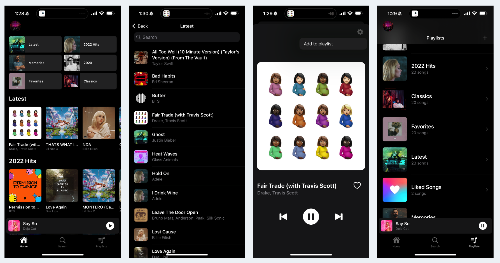
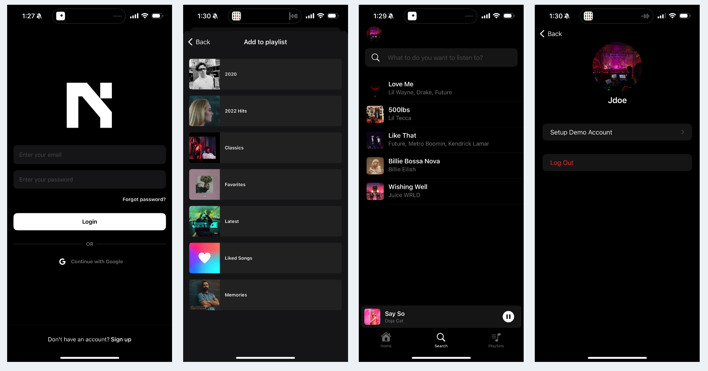
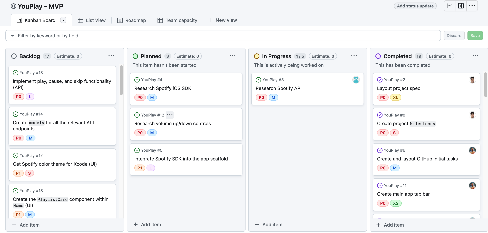

# YouPlay <!-- omit from toc -->

> A streamlined music streaming service that generates playlists based on the user's current mood.
>
> **Developed by:** [Heather Browning](https://www.linkedin.com/in/bunnymouses/), [Joshua Lopes](https://www.linkedin.com/in/joshua-lopes-aaab05188/), [Sebastian Nunez](https://www.linkedin.com/in/sebastian-nunez-profile/), [Yixin (Fiona) Zhao](https://www.linkedin.com/in/yixin-zhao-/)

## Table of Contents <!-- omit from toc -->

- [Technologies](#technologies)
- [Project Board](#project-board)
- [Core Features](#core-features)
  - [Authentication](#authentication)
  - [Player Controls](#player-controls)
  - [Song Search](#song-search)
  - [Playlist Management](#playlist-management)
  - [Playlist Interaction](#playlist-interaction)
- [Getting Started](#getting-started)
- [Product Spec](#product-spec)
  - [User Stories](#user-stories)
  - [Screen Archetypes](#screen-archetypes)
  - [Navigation](#navigation)
  - [Wireframes](#wireframes)
- [Internal Services](#internal-services)
- [Data Models](#data-models)

## Technologies

- **Language:** Swift
- **iOS Framework:** SwiftUI
- **Auth:** [Firebase Auth](https://firebase.google.com/docs/auth)
- **Music Playback:** [Spotify iOS SDK](https://github.com/spotify/ios-sdk)
- **Song Metadata:** [Spotify Web API](https://developer.spotify.com/documentation/web-api)
- **Database**
  - **NoSQL:** [Firebase Firestore](https://firebase.google.com/docs/firestore)
  - **Object Storage:** [Firebase Storage](https://firebase.google.com/docs/storage)

## Project Board

You can find our project board [here.](https://github.com/orgs/you-play/projects/1)

## Core Features

### Authentication

- Complete authentication flow (login, sign up, logout) using email and password alongside [Google OAuth](https://developers.google.com/identity/protocols/oauth2)
- Users can update their profile picture with direct upload to [Firebase Storage](https://firebase.google.com/docs/storage)
- Password reset functionality via email

### Player Controls

- Player interface displaying the currently playing song with audio playback controls
- Users can view song details by clicking on the crumb-bar
- Users can add songs to a playlist directly from a menu

### Song Search

- Users can search for any song
- Users can view their recently played songs

### Playlist Management

- Users can create and delete playlists
- Users can remove songs from a playlist

### Playlist Interaction

- Users can play any song
- Playlists are kept up-to-date using the `lastModified` date
- Users can refresh their playlists
- Implemented search for songs within a playlist by text

## Getting Started

### 1. Check out `CONTRIBUTING.md` <!-- omit from toc -->

Read through our [contributing document](./CONTRIBUTING.md) to get up-to-speed with project standards and expectations.

### 2. Create a `Firebase` iOS application <!-- omit from toc -->

Our application runs mostly through Google's [Firebase](https://firebase.google.com/) platform.

You can go [here](https://firebase.google.com/docs/ios/setup) to get started setting up an iOS application.

### 3. Create a `Spotify` API application <!-- omit from toc -->

Head over to your [Spotify Dashboard](https://developer.spotify.com/dashboard/) and register a new application.

**App name:** `YouPlay`

**App description:** `A mood based music streaming service.`

**Website:** _Can be left empty_

**Redirect URI:** `spotify-ios-you-play://spotify-login-callback`

**Which API/SDKs are you planning to use?**

- [x] `Web API`
- [x] `iOS`

After you have done the initial setup, open the app's `Settings` and add the following **iOS app bundles**:

- `com.you-play.YouPlay`

Your settings should be similar to [this.](./assets//docs/spotify_app_dashboard.png)

Lastly, make sure the [App bundle](./assets/docs/bundle_id.png) within `XCode` matches above.

**Note:** If the bundle ID is NOT available in `XCode`, you can add a suffix (ex. `com.you-play.YouPlay-Sebastian`). Make sure to update it in your [Spotify Dashboard](https://developer.spotify.com/dashboard/) settings.

### 4. Run the App Locally <!-- omit from toc -->

1. Clone the repo: `git clone https://github.com/you-play/YouPlay/`
2. Download the `GoogleService-Info.plist` (not required if you have your own Firebase app) and `SpotifyService.plist` from our [Google Drive](https://drive.google.com/drive/u/0/folders/1mpas-2XIVRFXT4UJKt6yppe0XE1tgUjC) (or you can find empty "templates" [here](./assets/docs/templates/))
3. Replace/add the `CLIENT_ID` and `CLIENT_SECRET` in the `SpotifyService.plist` with your own Spotify credentials
4. Add the `GoogleService-Info.plist` and `SpotifyService.plist` into `/ios-app/YouPlay/` folder (**Tip:** you can drop the files directly into the `XCode` UI file explorer)
5. Build and start the app in `Xcode`

## Product Spec

### User Stories

#### Required Must-have Stories <!-- omit from toc -->

**As a** user,
**I want** to select my current mood from a _select_ list of songs (based on energy, and dance-ability...)
**so I can** quickly receive a playlist that matches how I'm feeling.

**As a** user,
**I want** to be able to play, pause, and skip songs (no shuffle, forward and backward) in the playlist
**so I can** bypass tracks that don't quite fit my mood or take a break.

**As a** user,
**I want** to discover new music tailored to my mood
**so I can** expand my musical tastes while staying within the emotional context I prefer.

**As a** user,
**I want** to save playlists generated based on my mood
**so I can** listen to them again later.

**As a** user,
**I want** to see the name of the currently playing song and its artist
**so I can** explore more from artists I like.

**As a** user,
**I want** to adjust the number of songs on the playlist based on my available time
**so that** the music lasts for my desired listening period.

**As a** user,
**I want** to be able to "Like" tracks and have a "Liked Tracks" playlist automatically generated
**so I can** improve future playlist recommendations.

**As a** user,
**I want** to provide feedback on playlist suggestions
**so that** the app can refine its future recommendations for me.

#### Optional (Nice-to-have Stories) <!-- omit from toc -->

**As a** user,
**I want** to create custom moods
**so I can** have even more personalized playlists that reflect my unique feelings.

**As a** user,
**I want** to combine multiple moods into a single playlist
**so I can** enjoy a mix that reflects my complex emotional state.

**As a** user,
**I want** to set mood-based alarms
**so I can** wake up or be reminded with music that fits how I want to feel.

**As a** user,
**I want** to see visualizations or artwork that match the mood of the current playlist **so I can**
enhance my listening experience.

**As a** user,
**I want** the option to filter songs by language or genre within a mood category
**so I can** tailor the music even further to my

### Screen Archetypes

- Login Screen
  - As a user, I must be able to log in
- Sign-up Screen
  - As a user, I must be able to create an account
- Profile screen
  - As a logged-in user, I should be able to click on my avatar and be taken to a profile screen.
- Mood Selector
  - As a logged-in user, I want to be prompted to select the mood I am in
- Suggested Songs Screen
  - As a logged-in user, I want to be able to see several songs that
- Unique Song Screen
  - As a user, I want to be able to click on a song cover and see the song in full screen.
  - As a user, I would like to navigate through a song
- My Playlist Screen
  - As a logged-in user, I want to be able to see all of my playlists
- Unique Playlist Screen
  - As a logged-in user, I want to be able to be able to browse through the songs in my playlist.
- Search bar
  - As a logged-in user, I should be able to search for songs.

### Navigation

**Tab Navigation** (Tab to Screen)

- [x] Home
- [x] Search
- [x] Playlists

**Flow Navigation** (Screen to Screen)

- [x] `Login/Sign-up`
  - Leads to `Home`
- [x] `Profile` (after clicking "Log out")
  - Leads to `Login/Sign-up`
- [x] `Home` (after clicking a `Playlist`)
      Leads to the `Playlist` screen for it
- [x] `Home` (after clicking a `Song`)
  - Leads to `Song/Playback` (bottom sheet) for it
- [x] `Song/Playback` (after dismissing a `Song` _bottom sheet_)
  - Leads to `Home`
- [x] `Song/Playback` (after hitting the "Add to Playlist" button)
  - Leads to `PlaylistSelection` _bottom sheet_

### Wireframes

#### Digital Wireframes <!-- omit from toc -->

## Internal Services

These are the main _planned_ network services available in the app.

**Note:** These are not kept up-to-date.

### `AuthService` <!-- omit from toc -->

Handles all internal communication and authentication with Firebase Auth.

### `PlaylistService` <!-- omit from toc -->

Handles internal playlist management (creation, delete, etc.).

### `PlaybackService` <!-- omit from toc -->

Handles all audio playback controls connected to the Spotify SDK controller.

### `SpotifyService` <!-- omit from toc -->

Connects the application to the Spotify Web API and allows querying and fetching song metadata.

### `StorageService` <!-- omit from toc -->

Handles object storage communication with Firebase Storage.

### `UserService` <!-- omit from toc -->

Handles user metadata access and retrieval (profile picture, demographics, etc.)

## Data Models

These are the core planned data models for the app.

**Note:** These are not kept up-to-date.

### `User` <!-- omit from toc -->

| Property        | Type    | Description                                          |
| --------------- | ------- | ---------------------------------------------------- |
| uid             | String? | Firestore ID                                         |
| username        | String  | Username of the user                                 |
| email           | String  | Email of the user                                    |
| id              | String  | Unique identifier (fallback to UUID if `uid` is nil) |
| age             | Int?    | Age of the user (optional)                           |
| gender          | Gender? | Gender of the user (enum or optional string)         |
| profileImageUrl | String? | URL of the user's profile image (optional)           |

### `Player` <!-- omit from toc -->

| Property     | Type    | Description                                  |
| ------------ | ------- | -------------------------------------------- |
| repeatState  | String  | State of repeat functionality                |
| shuffleState | Bool    | State of shuffle functionality               |
| isPlaying    | Bool    | Indicates if a song is currently playing     |
| song         | Song    | Information about the currently playing song |
| actions      | Actions | Actions that can be performed on the player  |

### `Actions` <!-- omit from toc -->

| Property              | Type | Description                                       |
| --------------------- | ---- | ------------------------------------------------- |
| interruptingPlayback  | Bool | Indicates if playback is being interrupted        |
| pausing               | Bool | Indicates if playback is being paused             |
| resuming              | Bool | Indicates if playback is being resumed            |
| seeking               | Bool | Indicates if seeking within the playback          |
| skippingNext          | Bool | Indicates if skipping to the next track           |
| skippingPrev          | Bool | Indicates if skipping to the previous track       |
| togglingRepeatContext | Bool | Indicates toggling repeat for the current context |
| togglingShuffle       | Bool | Indicates toggling shuffle mode                   |
| togglingRepeatTrack   | Bool | Indicates toggling repeat for the current track   |
| transferringPlayback  | Bool | Indicates if playback is being transferred        |

### `Album` <!-- omit from toc -->

| Property    | Type         | Description                                   |
| ----------- | ------------ | --------------------------------------------- |
| albumType   | String       | Type of the album (e.g., "album", "single")   |
| totalTracks | Int          | Total number of tracks in the album           |
| href        | String       | URL of the album                              |
| id          | String       | Unique identifier of the album                |
| images      | [AlbumImage] | Array of images representing the album        |
| name        | String       | Name of the album                             |
| uri         | String       | Spotify URI of the album                      |
| artists     | [Artist]     | Array of artists who contributed to the album |
| tracks      | Tracks       | Information about the tracks in the album     |
| popularity  | Int          | Popularity score of the album                 |

### `SpotifyImage` <!-- omit from toc -->

| Property | Type   | Description                         |
| -------- | ------ | ----------------------------------- |
| url      | String | URL of the album image              |
| height   | Int?   | Height of the album image in pixels |
| width    | Int?   | Width of the album image in pixels  |

### `Artist` <!-- omit from toc -->

| Property | Type   | Description                     |
| -------- | ------ | ------------------------------- |
| id       | String | Unique identifier of the artist |
| name     | String | Name of the artist              |

### `Song` <!-- omit from toc -->

| Property   | Type     | Description                                    |
| ---------- | -------- | ---------------------------------------------- |
| documentID | String?  | Firestore document ID                          |
| title      | String   | Title of the song                              |
| artists    | [String] | Array of artist names contributing to the song |
| imageURL   | String   | URL of the image representing the song         |
| id         | String   | Unique identifier for the song                 |

### `TracksResponse` <!-- omit from toc -->

| Property | Type   | Description                                      |
| -------- | ------ | ------------------------------------------------ |
| items    | [Song] | Array of song responses representing tracks      |
| limit    | Int    | Maximum number of items returned in the response |
| offset   | Int    | Offset for the paginated response                |
| total    | Int    | Total number of items available                  |
