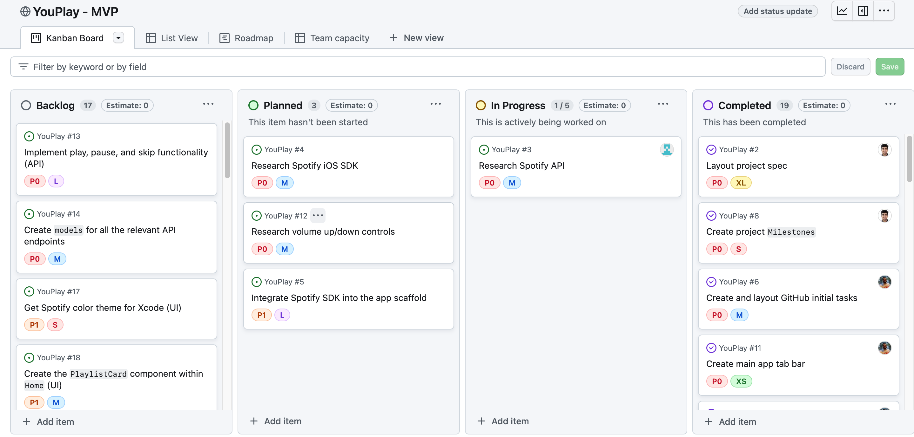

# YouPlay <!-- omit from toc -->

## Table of Contents <!-- omit from toc -->

- [Overview](#overview)
  - [Description](#description)
  - [App Evaluation](#app-evaluation)
- [Technologies](#technologies)
- [Running Locally](#running-locally)
- [Project Board](#project-board)
- [Demos](#demos)
  - [Auth Flow](#auth-flow)
  - [Player Crumb-bar](#player-crumb-bar)
  - [Search Bar](#search-bar)
- [Product Spec](#product-spec)
  - [User Stories](#user-stories)
    - [Required Must-have Stories](#required-must-have-stories)
    - [Optional (Nice-to-have Stories)](#optional-nice-to-have-stories)
- [Screen Archetypes](#screen-archetypes)
  - [Navigation](#navigation)
- [Wireframes](#wireframes)
  - [Digital Wireframes](#digital-wireframes)
- [Schema](#schema)
  - [Models](#models)
  - [Networking](#networking)

## Overview

### Description

This app is a streamlined music streaming service that generates playlists based on the user's current mood.
Upon opening the app, users select their mood, and a curated playlist that matches their selection is immediately suggested.

### App Evaluation

- **Category:** Music streaming, social
- **Mobile:** Yes
- **Story:** Tailored for those who seek music to match and amplify their emotions—whether it's for comfort, motivation, relaxation, or energy.
- **Market:** Individuals who own an iOS device and are willing to stream music.
- **Habit:** Users are meant to use the app throughout their day.
- **Scope:** Our goal is to develop an MVP with a short scope of features and work from there. Focused on making the app functional and user-friendly.

## Technologies

- **Language:** Swift
- **iOS Framework:** SwiftUI
- **Auth:** Firebase Auth
- **Database**
  - **NoSQL:** Firebase Firestore
  - **Object Storage:** Firebase Storage

## Running Locally

1. Clone the repo: `git clone https://github.com/ios-102/YouPlay`
2. Add the `GoogleService-Info.plist` into `/ios-app/YouPlay/` folder
3. Start the app in `Xcode`

## Project Board

## Demos

### Auth Flow

- Complete auth flow (log in, sign up, logout) using email and password alongside Google OAuth.

- Users are able to update their profile picture and have it uploaded directly to Firebase Storage.

- Password reset available via email.

### Player Crumb-bar

- Users able to view the song that's currently playing
- Users can click on the crumb-bar and open the details for that specific song

### Search Bar

- Users able to search for songs

## Product Spec

### User Stories

#### Required Must-have Stories

**As a** user,
**I want** to select my current mood from a _select_ list of songs (based on energy, and dance-ability...)
**so I can** quickly receive a playlist that matches how I'm feeling.

**As a** user,
**I want** to be able to play, pause, and skip songs (no shuffle, forward and backward) in the playlist
**so I can** bypass tracks that don't quite fit my mood or take a break.

**As a** user,
**I want** to discover new music tailored to my mood
**so I can** expand my musical tastes while staying within the emotional context I prefer.

**As a** user,
**I want** to save playlists generated based on my mood
**so I can** listen to them again later.

**As a** user,
**I want** to see the name of the currently playing song and its artist
**so I can** explore more from artists I like.

**As a** user,
**I want** to adjust the number of songs on the playlist based on my available time
**so that** the music lasts for my desired listening period.

**As a** user,
**I want** to be able to "Like" tracks and have a "Liked Tracks" playlist automatically generated
**so I can** improve future playlist recommendations.

**As a** user,
**I want** to provide feedback on playlist suggestions
**so that** the app can refine its future recommendations for me.

#### Optional (Nice-to-have Stories)

**As a** user,
**I want** to create custom moods
**so I can** have even more personalized playlists that reflect my unique feelings.

**As a** user,
**I want** to combine multiple moods into a single playlist
**so I can** enjoy a mix that reflects my complex emotional state.

**As a** user,
**I want** to set mood-based alarms
**so I can** wake up or be reminded with music that fits how I want to feel.

**As a** user,
**I want** to see visualizations or artwork that match the mood of the current playlist **so I can**
enhance my listening experience.

**As a** user,
**I want** the option to filter songs by language or genre within a mood category
**so I can** tailor the music even further to my

## Screen Archetypes

- Login Screen
  - As a user, I must be able to log in
- Sign-up Screen
  - As a user, I must be able to create an account
- Profile screen
  - As a logged-in user, I should be able to click on my avatar and be taken to a profile screen.
- Mood Selector
  - As a logged-in user, I want to be prompted to select the mood I am in
- Suggested Songs Screen
  - As a logged-in user, I want to be able to see several songs that
- Unique Song Screen
  - As a user, I want to be able to click on a song cover and see the song in full screen.
  - As a user, I would like to navigate through a song
- My Playlist Screen
  - As a logged-in user, I want to be able to see all of my playlists
- Unique Playlist Screen
  - As a logged-in user, I want to be able to be able to browse through the songs in my playlist.
- Search bar
  - As a logged-in user, I should be able to search for songs.

### Navigation

**Tab Navigation** (Tab to Screen)

- [ ] Home
- [x] Search
- [ ] Playlists

**Flow Navigation** (Screen to Screen)

- [x] `Login/Sign-up`
  - Leads to `Home`
- [x] `Profile` (after clicking "Log out")
  - Leads to `Login/Sign-up`
- [ ] `Home` (after clicking a `Playlist`)
      Leads to the `Playlist` screen for it
- [ ] `Home` (after clicking a `Song`)
  - Leads to `Song/Playback` (bottom sheet) for it
- [x] `Song/Playback` (after dismissing a `Song` _bottom sheet_)
  - Leads to `Home`
- [ ] `Song/Playback` (after hitting the "Add to Playlist" button)
  - Leads to `PlaylistSelection` _bottom sheet_

## Wireframes

### Digital Wireframes

## Schema

### Models

`User` model

| Property        | Type    | Description                                          |
| --------------- | ------- | ---------------------------------------------------- |
| uid             | String? | Firestore ID                                         |
| username        | String  | Username of the user                                 |
| email           | String  | Email of the user                                    |
| id              | String  | Unique identifier (fallback to UUID if `uid` is nil) |
| age             | Int?    | Age of the user (optional)                           |
| gender          | Gender? | Gender of the user (enum or optional string)         |
| profileImageUrl | String? | URL of the user's profile image (optional)           |

`Player` model:

| Property     | Type    | Description                                  |
| ------------ | ------- | -------------------------------------------- |
| repeatState  | String  | State of repeat functionality                |
| shuffleState | Bool    | State of shuffle functionality               |
| isPlaying    | Bool    | Indicates if a song is currently playing     |
| song         | Song    | Information about the currently playing song |
| actions      | Actions | Actions that can be performed on the player  |

`Actions` model:

| Property              | Type | Description                                       |
| --------------------- | ---- | ------------------------------------------------- |
| interruptingPlayback  | Bool | Indicates if playback is being interrupted        |
| pausing               | Bool | Indicates if playback is being paused             |
| resuming              | Bool | Indicates if playback is being resumed            |
| seeking               | Bool | Indicates if seeking within the playback          |
| skippingNext          | Bool | Indicates if skipping to the next track           |
| skippingPrev          | Bool | Indicates if skipping to the previous track       |
| togglingRepeatContext | Bool | Indicates toggling repeat for the current context |
| togglingShuffle       | Bool | Indicates toggling shuffle mode                   |
| togglingRepeatTrack   | Bool | Indicates toggling repeat for the current track   |
| transferringPlayback  | Bool | Indicates if playback is being transferred        |

`Album` model

| Property    | Type         | Description                                   |
| ----------- | ------------ | --------------------------------------------- |
| albumType   | String       | Type of the album (e.g., "album", "single")   |
| totalTracks | Int          | Total number of tracks in the album           |
| href        | String       | URL of the album                              |
| id          | String       | Unique identifier of the album                |
| images      | [AlbumImage] | Array of images representing the album        |
| name        | String       | Name of the album                             |
| uri         | String       | Spotify URI of the album                      |
| artists     | [Artist]     | Array of artists who contributed to the album |
| tracks      | Tracks       | Information about the tracks in the album     |
| popularity  | Int          | Popularity score of the album                 |

`SpotifyImage` model

| Property | Type   | Description                         |
| -------- | ------ | ----------------------------------- |
| url      | String | URL of the album image              |
| height   | Int    | Height of the album image in pixels |
| width    | Int    | Width of the album image in pixels  |

`Tracks` model

| Property | Type    | Description                        |
| -------- | ------- | ---------------------------------- |
| next     | String? | URL of the next page of tracks     |
| previous | String? | URL of the previous page of tracks |

`Artist`model

| Property | Type   | Description                     |
| -------- | ------ | ------------------------------- |
| id       | String | Unique identifier of the artist |
| name     | String | Name of the artist              |

`Song` model

| Property   | Type     | Description                                    |
| ---------- | -------- | ---------------------------------------------- |
| documentID | String?  | Firestore document ID                          |
| title      | String   | Title of the song                              |
| artists    | [String] | Array of artist names contributing to the song |
| imageURL   | String   | URL of the image representing the song         |
| id         | String   | Unique identifier for the song                 |

`TracksResponse` model

| Property | Type   | Description                                      |
| -------- | ------ | ------------------------------------------------ |
| items    | [Song] | Array of song responses representing tracks      |
| limit    | Int    | Maximum number of items returned in the response |
| offset   | Int    | Offset for the paginated response                |
| total    | Int    | Total number of items available                  |

`SpotifyImage` model

| Property | Type   | Description                   |
| -------- | ------ | ----------------------------- |
| url      | String | URL of the image              |
| height   | Int    | Height of the image in pixels |
| width    | Int    | Width of the image in pixels  |

### Networking

#### Spotify Service

- func getAccessToken() async -> String?
- func search(text: String) async -> SpotifySearchResponse?

#### Authorization Service

- func login(email: String, password: String) async throws
- func loginWithGoogle() async throws
- func createUser(email: String, password: String) async throws
- func logout()
- func resetPassword(email: String) async throws

#### Storage Service

- func uploadImage(bucket: StorageBuckets, fileName: String, imageData: Data, fileExtension: ImageFileExtension)
  async throws -> String

#### UserService

- func getUserMetadata(uid: String) async throws -> User?
- func updateUserMetadata(uid: String, user: User) async throws
- func updateProfileImage(uid: String, imageData: Data) async throws
