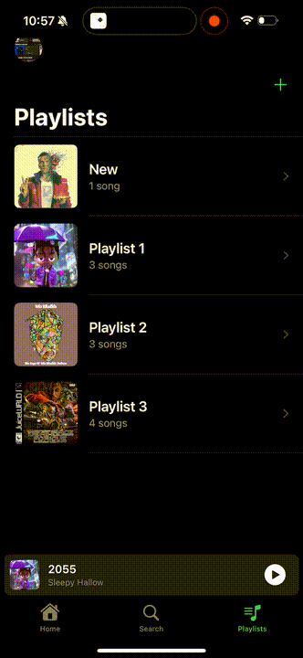
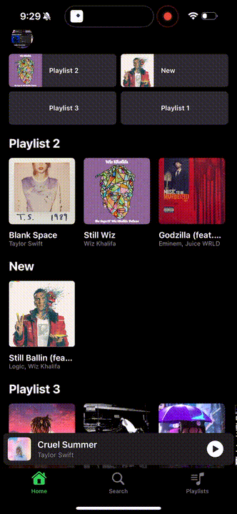
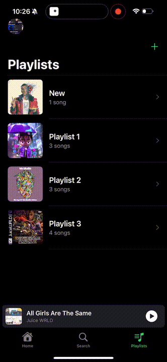

# YouPlay

These are some of the demos while development was under way.

## Demos

### Auth Flow

- Complete auth flow (log in, sign up, logout) using email and password alongside Google OAuth.

- Users are able to update their profile picture and have it uploaded directly to Firebase Storage.

- Password reset available via email.

### Player Crumb-bar

- Users able to view the song that's currently playing
- Users can click on the crumb-bar and open the details for that specific song

### Search Bar

- Users able to search for songs

### Playlist Management

- Users able to:
  - Create/delete playlists
  - Remove songs from a playlist

### Playlist Flow

- Users are able to:
  - Play any song they like
  - Add any song to a playlist (if it's not a duplicate
- Playlists are kept up-to-date by `lastModified` date
- Playlist have the image of the last song added to it
- Users can refresh their playlists

### Recent Songs

- Users are able to view their recent songs

### Playlist Search & Filtering

- Users are able to search for a song within a playlist by text

